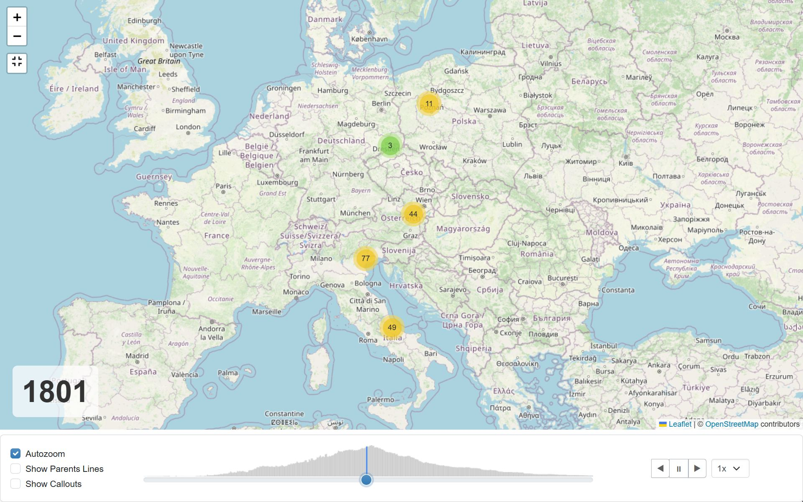
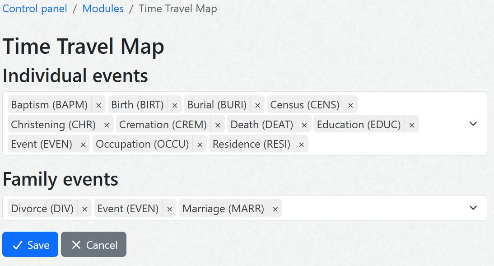
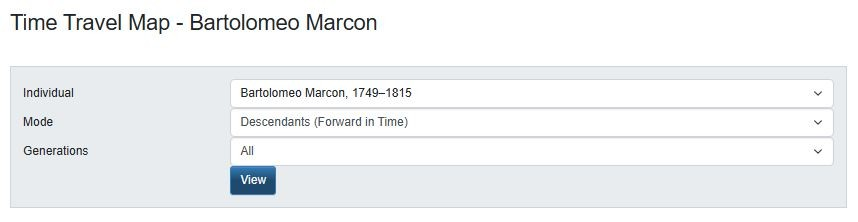

# Time Travel Map

An interactive map with a timeline for exploring the geographic history of your family tree.

*Fig. 1: Exploring generations as clusters of individuals

*Fig. 2: Exploring generations with callouts showing short information on the individuals

## Features

- **Interactive Map**: Map visualization using Leaflet.js
  - Option to **auto-zoom** to focus on historical areas of interest as you move through time.
  - Option to show individuals as **clustered points** or **callouts** with name and lifespan.
  - Points/callouts can be clicked to show more detailed events located in time and space, with a link to the standard individual page.
- **Ancestry & Descendants**: Supports both backward (ancestors) and forward (descendants) exploration.
- **Timeline slider**: Quick navigation through time, with a histogram of how many individuals are alive at that time.
- **Autoplay**: Automatically advances the timeline through time forward or backwards in time at a configurable speed.
- **Event Visualization**: Displays birth, death, and marriage events on the map.
- **Customizable**: Configure which events to display and other display options.

## Installation

1. Download the module from the [Releases](https://github.com/gmarcon/webtrees-time-travel-map/releases) page.
2. Extract the archive into the `modules_v4` directory of your Webtrees installation (avoid points in the name of the folder).
3. Log in to Webtrees as an administrator.
4. Navigate to **Control Panel** > **Modules** and click either in **All modules** or **Charts** under the Genealogy group
5. Check that the module is listed and enabled an select **Preferences**.
6. Configure the individual and family events that you want to include in the timeline, the more common events are already proposed as a default setting.
7. Click **Save** to apply the changes.

*Fig. 3: Configuration page in the preferences of the module

## Usage

1. Navigate to the **Time Travel Map** page from the **Charts** menu.
2. Select a starting individual.
3. Choose the direction: **Ancestors** (backward in time) or **Descendants** (forward in time).
4. Select the number of **Generations** to display.
5. Click **View** to generate the map and start exploring!

*Fig. 4: Selection of the paramters to start the exploration